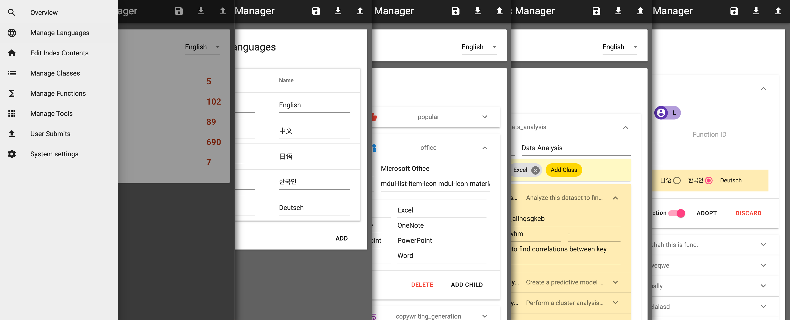

<h1 align="center">
    PromptGenius Manager
</h1>
<p align="center">
    <em>GUI for managing PromptGenius Database</em> | <a href="https://github.com/wenhaomin/PromptGenius">PromptGenius</a>
</p>



This project is meant to build an easy-to-use GUI software for managing and editing various contents in PromptGenius.

## Run and build

```bash
# Install required packages
npm install

# Run application with npm
npm run start

# Development
npm run dev

# Pack executable application for your architecture
node_modules/.bin/electron-packager . --icon="instance/favicon.ico"
```

## Usage

In the "System Settings" page, input the IP and path pointing to the SQLite database on your server.

Click the "Download from DB" button and wait for it to finish. Now you should be able to see your contents on other pages.

## TODO List

- [x] Currently, the save functions on "Manage Classes", "Manage Functions", "Manage Tools", and "User Submits" pages are not implemented.
- [x] The "Manage Functions" page has bad performance if the number of entries is large. Should implement a filter function.
- [ ] The class selection dialog currently lists all existing classes flat. Should implement a hierachical selection akin to that in "Manage Classes" page.
- [ ] Many errors are not handled properly and currently will be thrown by the electron process.